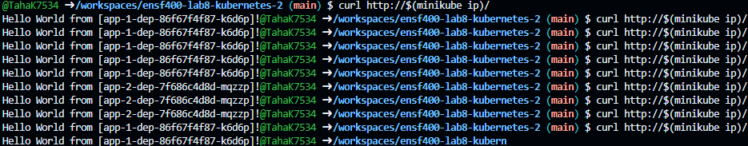
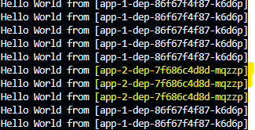

# Assignment 3 Steps/Outputs - Taha Khan (30145085)

This file looks at the steps required to run the program, along with the expected outputs for each command. 

## Step 1: Setup
In order to be able to run the program there are a few setup commands that need to be run. These commands all need to be run in the deafult directory, you DO NOT need to cd into any folders. 

the first comand is `minikube start`, this will make it so kubectl is configued to use minikube.

The output shoud look like this 

```bash
@TahaK7534 ➜ /workspaces/ensf400-lab8-kubernetes-2 (main) $ minikube start
😄  minikube v1.32.0 on Ubuntu 20.04 (docker/amd64)
✨  Automatically selected the docker driver. Other choices: none, ssh
📌  Using Docker driver with root privileges
👍  Starting control plane node minikube in cluster minikube
🚜  Pulling base image ...
💾  Downloading Kubernetes v1.28.3 preload ...
    > preloaded-images-k8s-v18-v1...:  403.35 MiB / 403.35 MiB  100.00% 176.27 
    > gcr.io/k8s-minikube/kicbase...:  453.46 MiB / 453.90 MiB  99.90% 52.89 Mi
🔥  Creating docker container (CPUs=2, Memory=2200MB) ...
🐳  Preparing Kubernetes v1.28.3 on Docker 24.0.7 ...
    ▪ Generating certificates and keys ...
    ▪ Booting up control plane ...
    ▪ Configuring RBAC rules ...
🔗  Configuring bridge CNI (Container Networking Interface) ...
    ▪ Using image gcr.io/k8s-minikube/storage-provisioner:v5
🔎  Verifying Kubernetes components...
🌟  Enabled addons: default-storageclass, storage-provisioner
🏄  Done! kubectl is now configured to use "minikube" cluster and "default" namespace by default
@TahaK7534 ➜ /workspaces/ensf400-lab8-kubernetes-2 (main) $ 

```

Also as part of the setup you will need to run this command to enable ingress
`minikube addons enable ingress`, you will need to wait a little bit after the comand finishes running before running any other commands.

With the output looking like this 

```bash
@TahaK7534 ➜ /workspaces/ensf400-lab8-kubernetes-2 (main) $ minikube addons enable ingress
💡  ingress is an addon maintained by Kubernetes. For any concerns contact minikube on GitHub.
You can view the list of minikube maintainers at: https://github.com/kubernetes/minikube/blob/master/OWNERS
    ▪ Using image registry.k8s.io/ingress-nginx/controller:v1.9.4
    ▪ Using image registry.k8s.io/ingress-nginx/kube-webhook-certgen:v20231011-8b53cabe0
    ▪ Using image registry.k8s.io/ingress-nginx/kube-webhook-certgen:v20231011-8b53cabe0
🔎  Verifying ingress addon...
🌟  The 'ingress' addon is enabled
@TahaK7534 ➜ /workspaces/ensf400-lab8-kubernetes-2 (main) $ 
```


## Step 2: Compiling all the code
There are many ways to compile all the code however the simplist way I have found is using the following comand `kubectl apply -f .`. This command will go ahead and compile all the files. the output should look like this.

```bash
@TahaK7534 ➜ /workspaces/ensf400-lab8-kubernetes-2 (main) $ kubectl apply -f .
deployment.apps/app-1-dep created
ingress.networking.k8s.io/app-1-ingress created
service/app-1-svc created
deployment.apps/app-2-dep created
ingress.networking.k8s.io/app-2-ingress created
service/app-2-svc created
configmap/nginx-configmap created
deployment.apps/nginx-dep created
ingress.networking.k8s.io/nginx-ingress created
service/nginx-svc created
@TahaK7534 ➜ /workspaces/ensf400-lab8-kubernetes-2 (main) $ 
```


also in order to Verify that everything is working correctly you can run the following command and you should get the following output. `kubectl get pods`.

The output should be: 

```bash 
@TahaK7534 ➜ /workspaces/ensf400-lab8-kubernetes-2 (main) $ kubectl get pods
NAME                         READY   STATUS    RESTARTS   AGE
app-1-dep-86f67f4f87-frfbm   1/1     Running   0          2m2s
app-2-dep-7f686c4d8d-nnbjt   1/1     Running   0          2m1s
nginx-dep-5c95cc7fb8-4gpdc   1/1     Running   0          2m1s
nginx-dep-5c95cc7fb8-74w67   1/1     Running   0          2m1s
nginx-dep-5c95cc7fb8-kwvdf   1/1     Running   0          2m1s
nginx-dep-5c95cc7fb8-r4chk   1/1     Running   0          2m1s
nginx-dep-5c95cc7fb8-zmrf9   1/1     Running   0          2m1s
@TahaK7534 ➜ /workspaces/ensf400-lab8-kubernetes-2 (main) $ 
```

Note that they should all have the ratus running.

## Step 3: Running curl

Now that everything is setup we can go ahead and run the curl command. 
`curl http://$(minikube ip)/`

We are going to run this command 10 times to show that 70% of trafic goes to app-1 and 30% goes to app-2. 






also another way to confrim that 70% trafic goes to app-1 and 30% to app-2 I wrote a simple bash script to test it it can be seen bellow, the file is called curl_count.sh
```bash
#!/bin/bash

app1_count=0
app2_count=0

for i in {1..100}; do
    result=$(curl -s http://$(minikube ip)/)
    if [[ $result == *"app-1"* ]]; then
        ((app1_count++))
    elif [[ $result == *"app-2"* ]]; then
        ((app2_count++))
    fi
done

echo "Number of results from app-1: $app1_count"
echo "Number of results from app-2: $app2_count"

```

in order to run it you can simply run `chmod +x curl_count.sh` and then run `./curl_count.sh` this will then give an output like this
```bash
@TahaK7534 ➜ /workspaces/ensf400-lab8-kubernetes-2 (main) $ ./curl_count.sh 
Number of results from app-1: 71
Number of results from app-2: 29
```

although it is not exact, it is still working as inteded because it is a random chance, for 70 and 30% for each app. 

## Step 4 clean up

you can simply run `kubectl delete -f .` to delete all the pods created before